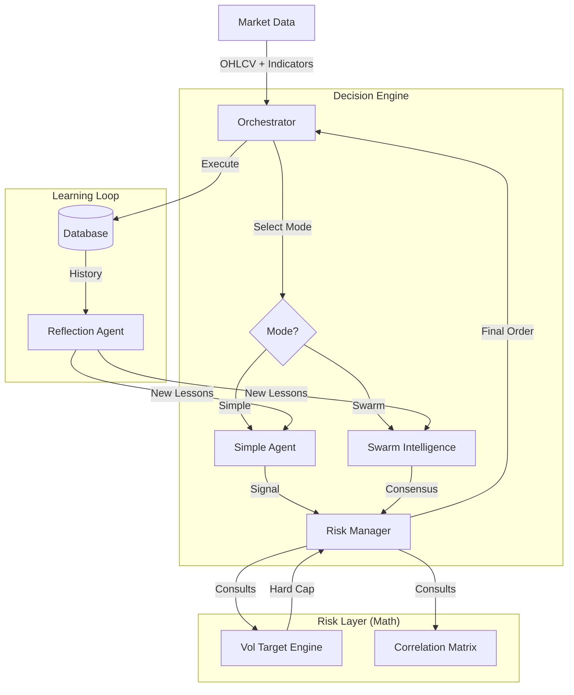

# Antigravity Trading System (Alpha v2.1)


> **Institutional-Grade Hybrid Trading System**.
> A Neuro-Symbolic architecture combining **Swarm Intelligence** (LLMs) with **Quantitative Risk Engineering** (Volatility Targeting).

---

## 📖 Executive Summary

This system bridges the gap between **Discretionary Trading** and **Quantitative Finance**. It is not a black-box AI, but an **Orchestrated Agentic Workflow** that:

1.  **Perceives (Right Brain):** Uses LLMs (Gemini, GPT-4) to read market structure, sentiment, and trend quality just like a human trader.
2.  **Protects (Left Brain):** Uses strict Mathematical Risk Engines (Kelly Criterion, Volatility Targeting) to size positions and enforce hard stops.
3.  **Adapts (Memory):** Uses a Reflection Agent to review past trades (and missed opportunities), generating "Lessons" that are injected into future decisions.

---

## 🏗 System Architecture

The codebase follows a modular **Service-Oriented Architecture (SOA)**.

### Core Components

| Module | Component | Responsibility |
| :--- | :--- | :--- |
| **Orchestrator** | `services/orchestrator.py` | The Central "Conductor". Manages the linear `See -> Think -> Act` lifecycle for all assets. |
| **Swarm Agent** | `agents/swarm.py` | **(Standard Mode)** A "Council" of LLM personas (Trend, MeanRev, Scalper) that debate and vote on direction. |
| **Simple Agent** | `agents/simple_agent.py` | **(Fast Mode)** A single-shot, high-reasoning agent (Gemini 2.0 Flash) optimized for speed and lower latency. |
| **Risk Agent** | `agents/risk_manager.py` | "The Safety Officer". Validates Swarm signals against technical invalidations and account limits. |
| **Reflection** | `agents/reflection.py` | "The Critic". Runs post-mortems on closed trades and audits "Skipped" trades to find missed pumps. |
| **Smart Cache** | `core/cache.py` | Prevents redundant LLM calls during low-volatility/flat market conditions to save costs. |

### Logic Flow



---

## ⚙️ Operating Modes

The system supports two distinct operation modes, configurable via `ENTRY_MODE` in `config.py` or runtime overrides.

### 1. Swarm Mode (Default)
*   **Best For:** Complex market conditions requiring diverse perspectives.
*   **Logic:** Spawns 3 diverse agents (Trend Follower, Contrarian, Whale Watcher).
*   **Aggregation:** A "Master" LLM synthesizes their disparate specific views into a final confidence score.
*   **Cost:** Higher (4 LLM calls per asset).
*   **Latency:** ~15-30s.

### 2. Simple Mode (Fast)
*   **Best For:** High-frequency checks or clear trending markets.
*   **Logic:** Uses a single, high-IQ model (e.g., Gemini 2.0 Flash) with a massive context window.
*   **Feature:** Includes "Smart Caching" — if price/RSI hasn't moved significantly since the last check, it returns the cached decision instantly (0s latency).
*   **Cost:** Low (1 LLM call per asset, often 0).
*   **Latency:** <5s.

---

## 🚀 Getting Started

### Prerequisites
*   Python 3.10+
*   MongoDB (cloud or local)
*   OpenRouter API Key (Supports Gemini 2.0, GPT-4o, Claude 3.5)

### Installation

1.  **Clone & Install**
    ```bash
    git clone https://github.com/malli7/trading-bot-backend.git
    cd trading-bot-backend
    python -m venv virtual
    source virtual/bin/activate
    pip install -r requirements.txt
    ```

2.  **Environment Setup**
    Create a `.env` file:
    ```env
    OPENROUTER_API_KEY=sk-or-v1-...
    MONGO_URI=mongodb+srv://...
    TRADING_MODE=SIMPLE  # or SWARM
    ```

3.  **Run System**
    ```bash
    # Starts API Server @ http://localhost:8001
    python main.py
    ```

---

## 🧠 Risk Management (The "Alpha")

Most retail bots fail because they over-leverage. This system prioritizes **Survival**.

*   **Volatility Targeting:** Position size is inversely proportional to asset volatility (ATR). High Vol = Small Size.
*   **Correlation Penalty:** If you are Long BTC, the system reduces size on Long ETH to prevent concentrated account risk.
*   **Infinite PnL Protection:** The "Risk Agent" is grounded by a rigid Python `RiskEngine` that physically prevents orders exceeding strict Kelly/Vol-Target limits.

---

## ⚠️ Disclaimer

**For Research & Educational Use Only.**
This software is a prototype for exploring Large Language Model capabilities in financial contexts. It is not financial advice. Use at your own risk.
